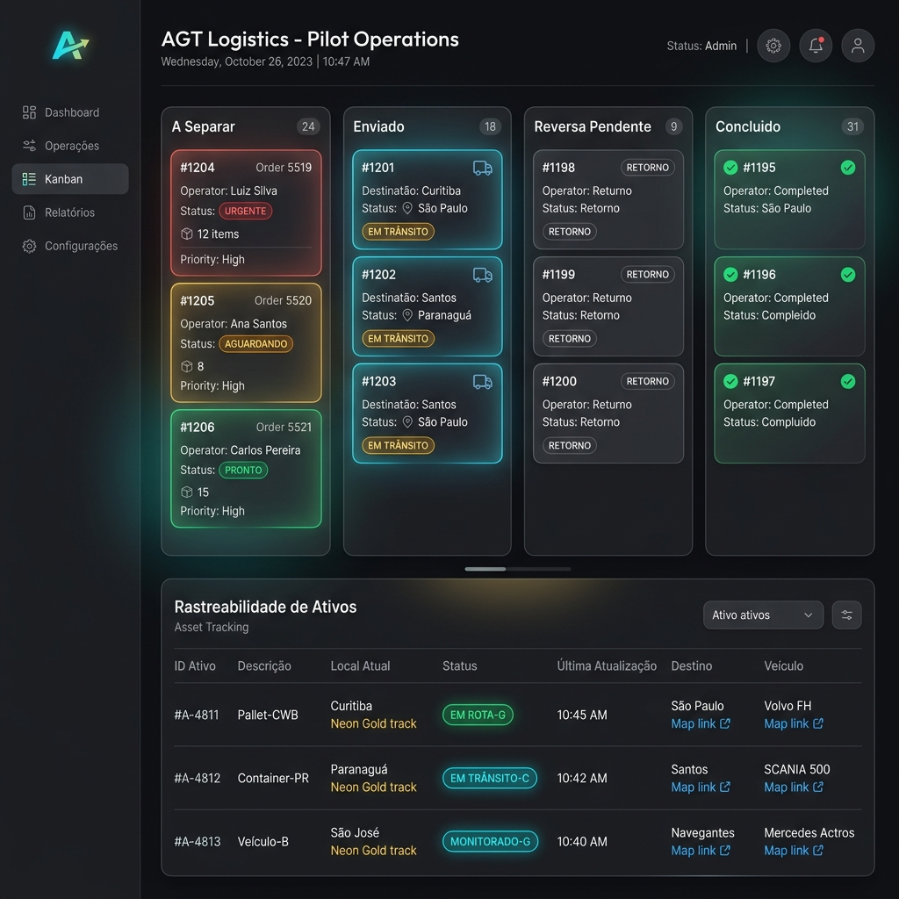
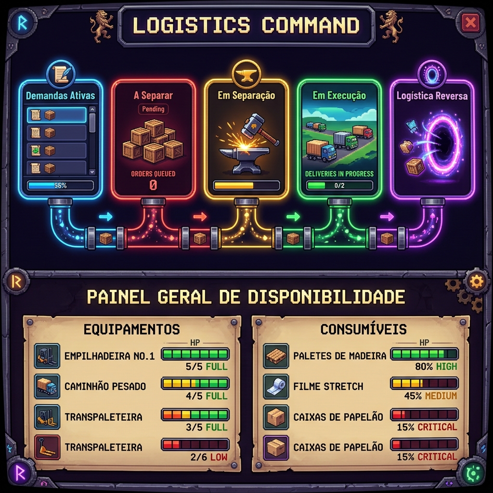

# Galeria de Telas do Sistema: AGT Logistics

Este documento apresenta as interfaces visuais desenvolvidas para o piloto do sistema **AGT Logistics**, demonstrando a experiência do usuário (UX/UI) tanto para o gerenciamento operacional quanto para a visão executiva.

---

## 1. Painel Operacional (Kanban Board & Rastreamento)

Esta tela é utilizada no dia a dia pelos consultores e operadores de estoque para criar pedidos, assumir a separação e auditar o despacho de kits de treinamento.

*   **Pipeline Kanban**: Quadros translúcidos com efeito de vidro (*glassmorphism*) que separam os pedidos por estágio (`A SEPARAR`, `ENVIADO`, `REVERSA PENDENTE`, `CONCLUIDO`).
*   **Controle de Operador**: Indicação visual de quem assumiu a separação física do kit, travando o botão de despacho até que um operador seja vinculado.
*   **Rastreabilidade Ativa**: Tabela dinâmica detalhando o estoque local ("Em Casa"), itens em trânsito ("Na Rua"), demandas futuras e alertas de priorização de coleta reversa.

---

## 2. Command Center (RPG Executive Dashboard)

Esta tela oferece uma visão executiva e macro do fluxo logístico global, adotando uma estética inovadora de console de jogo de estratégia (RPG Command Center).

*   **Quest Cards**: Contadores reativos brilhantes que representam as métricas da operação como conquistas de jogo ("Demandas Ativas", "Loot Trancado", "Forja Real").
*   **Fluxo de Partículas**: Indicador visual dinâmico que ilustra o tráfego físico e fluxo de materiais entre as etapas em tempo real.
*   **Cofre do Reino (Barras de HP do Estoque)**: Visualização do estoque de equipamentos lendários e consumíveis usando barras de vida (HP) que mudam de cor (Verde, Amarelo e Vermelho) baseadas na capacidade crítica do depósito.

