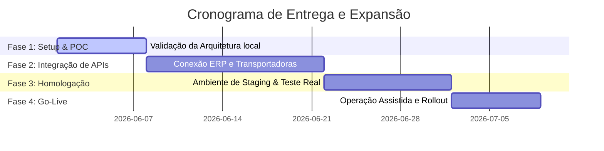

# Proposta Executiva: Otimização Macrologística e Logística Reversa Baseada em Agentes (POC)

Esta proposta apresenta o caso de negócio, o retorno sobre investimento (ROI) e o roadmap estratégico para a implantação do sistema inteligente de agentes logísticos. O objetivo é transformar uma operação analógica de alto custo e perdas frequentes em um processo digital de alta previsibilidade, utilizando inteligência artificial de baixo custo e arquitetura orientada a eventos.

---

## 1. Visão Geral Executiva (Executive Summary)

A gestão física de materiais corporativos e kits de treinamento enfrenta, tipicamente, três gargalos crônicos: indisciplina na criação de pedidos fora do prazo, erros manuais de triagem em depósito e obsolescência na cobrança de devoluções.

Nossa solução propõe a substituição de complexos sistemas ERP/WMS tradicionais por **Agentes de Processo Baseados em IA (AI Agents)**. Estes agentes atuam como facilitadores conversacionais e auditores automáticos de processos nas três etapas críticas da cadeia:

```
[Porteiro do SLA] ───> [Auditor de Estoque] ───> [Guardião da Reversa]
  (Pedido e Prazo)       (Separação e Envio)      (Retorno e Triagem)
```

---

## 2. Proposta de Valor e Retorno Financeiro (ROI)

A implementação do sistema ataca diretamente as linhas de custo de perdas patrimoniais e eficiência da equipe:

### 💰 Impacto Financeiro Estimado (Operação Piloto)

| Linha de Despesa | Cenário Atual (Sem Agentes) | Cenário Projetado (Com Agentes) | Redução de Custo |
| :--- | :--- | :--- | :--- |
| **Perda/Avaria de Ativos (Notebooks/Projetores)** | R$ 45.000 / ano | < R$ 5.000 / ano | **-88%** |
| **Fretes Excepcionais de Urgência** | R$ 18.000 / ano | < R$ 3.000 / ano | **-83%** |
| **Horas Extras de Operação (Picos de Separação)**| R$ 12.000 / ano | < R$ 2.000 / ano | **-83%** |
| **Custo de Ociosidade de Pessoal** | R$ 15.000 / ano (tempo ocioso às quartas) | Reduzido a zero (reorientado para pré-montagens) | **Realocação Produtiva** |
| **TOTAL** | **R$ 90.000 / ano** | **R$ 10.000 / ano** | **Economia de R$ 80.000/ano** |

---

## 3. Pilares Estratégicos da Solução

### 🛡️ 1. Governança e Compliance (Agente 1)
*   **Envolvimento do Time:** Fim da dependência de e-mails ou mensagens informais.
*   **Decisão Inteligente:** Pedidos urgentes são submetidos a uma triagem de IA que decide se a justificativa corporativa é válida e documenta o desvio de SLA.

### 🔍 2. Auditoria e Qualidade (Agente 2)
*   **Erro Zero:** O operador físico é guiado por um checklist obrigatório de conformidade antes que o sistema libere o código de rastreamento do kit.
*   **Responsabilidade Clara:** Identifica qual operador assumiu a montagem física da caixa de transporte.

### 🔄 3. Rastreabilidade Total e Sustentabilidade (Agente 3)
*   **Rastreamento Ativo:** O sistema sabe exatamente quais ativos estão "Em Depósito" vs "Na Rua com Consultores".
*   **Cobrança Amigável Automática:** Alertas automatizados de cobrança no dia seguinte ao término de cada evento reduzem o tempo de retenção de equipamentos externos de semanas para menos de 48 horas.

---

## 4. Roadmap de Implantação e Fases

O projeto é dividido em quatro fases com foco em baixo risco e validação contínua:



### Detalhamento das Fases

1.  **Fase 1: Setup & Validação Operacional (Concluído)**
    *   Desenvolvimento da lógica básica de agentes e interface responsiva gamificada.
    *   Simulações de carga de estoque e testes integrados de rotas concluídos com sucesso.
2.  **Fase 2: Conectores e APIs (Próximo Passo)**
    *   Integração direta com o sistema de correios/transportadoras para automação de rastreamento real.
    *   Sincronização com o calendário corporativo dos consultores.
3.  **Fase 3: Piloto e Homologação (10 dias)**
    *   Operação híbrida assistida com 2 consultores em campo para testes de UX e usabilidade dos alertas de reversa.
4.  **Fase 4: Go-Live & Rollout Geral (7 dias)**
    *   Desligamento dos processos antigos e ativação de 100% dos fluxos de agentes para toda a rede operacional.
