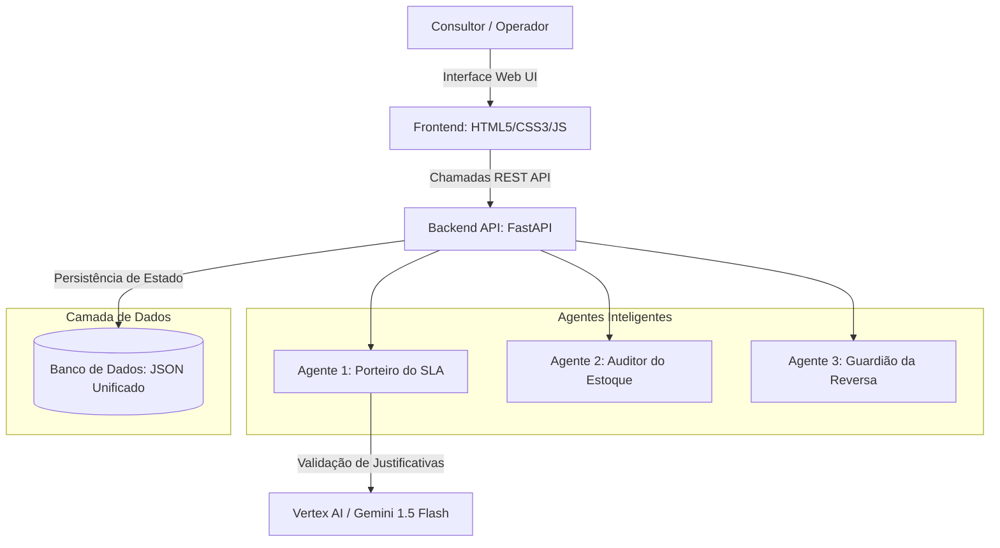
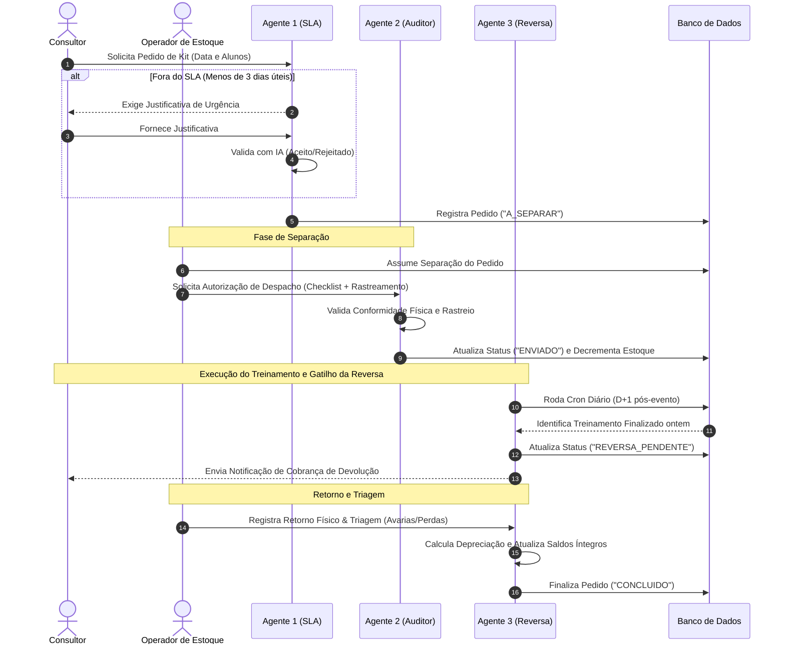

# Proposta Técnica: Sistema Inteligente de Macrologística e Logística Reversa (POC)

Este documento apresenta a especificação técnica e arquitetura de negócios do ecossistema de agentes autônomos para gestão de estoque e rastreamento de logística reversa. Projetado especificamente para operações de alta rotatividade de kits de treinamento e materiais corporativos, o sistema utiliza inteligência artificial e lógica orientada a eventos para mitigar perdas, garantir conformidade operacional e automatizar a cobrança de devoluções.

---

## 1. Desafios de Negócio Resolvidos

| Sintoma Operacional | Causa Raiz | Impacto Financeiro/Processual | Solução com Agentes (POC) |
| :--- | :--- | :--- | :--- |
| **Quebras de SLA de Envio** | Pedidos urgentes enviados por canais informais (WhatsApp) sem tempo hábil de separação. | Correria operacional, fretes de urgência mais caros e insatisfação do cliente. | **Agente 1 (Porteiro do SLA)** audita prazos e exige justificativas estruturadas validadas por IA. |
| **Erros na Separação Física** | Equipe operacional nova pulando etapas de conferência de itens críticos. | Kits entregues incompletos em campo, inviabilizando treinamentos. | **Agente 2 (Auditor de Estoque)** impede o despacho no sistema até que o operador assuma o pedido e valide o checklist. |
| **Apagão na Logística Reversa** | Falta de controle sobre os materiais que voltam com os consultores. | Alta taxa de depreciação e perda anual de laptops, projetores e insumos. | **Agente 3 (Guardião da Reversa)** rastreia a posse dos ativos e automatiza alertas de devolução no D+1 pós-evento. |

---

## 2. Arquitetura do Sistema (System Architecture)

A solução baseia-se em um acoplamento leve orientado a eventos, com agentes conversacionais interagindo diretamente com a base de dados.

> [!IMPORTANT]
> **Segurança e Baixa Latência:** A utilização de inteligência artificial na nuvem é encapsulada na validação heurística de urgência. Em caso de falha de conexão com a API da Vertex AI, o sistema conta com uma contingência heurística local para garantir que a operação não sofra interrupções.

---

## 3. Ciclo de Vida do Pedido & Fluxo de Eventos

O diagrama de sequência abaixo ilustra a jornada completa de um kit de treinamento, cobrindo a validação de entrada, a separação física, o trânsito, a execução do evento, o recolhimento e a triagem final de avarias.

---

## 4. Diferenciais de Inteligência do Sistema

### 🔮 A) Planejamento Preditivo de Compras (Abastecimento Inteligente)
O sistema não trabalha apenas com estoque mínimo estático. O Agente de Suprimentos realiza uma varredura contínua em todos os pedidos futuros com status `A_SEPARAR`.
*   Soma a demanda nominal do kit de treinamento (ex: 2 Laptops por aluno + Canetas).
*   Soma os insumos extras solicitados manualmente pelo consultor.
*   Cruza a demanda total futura com o estoque físico atual disponível.
*   Gera uma lista recomendada de compras preventivas detalhando o código, descrição e quantidade exata faltante para evitar faltas operacionais.

### 📍 B) Rastreabilidade Cruzada de Ativos
Com o painel de rastreabilidade ativa, os gestores visualizam em tempo real o balanço dos ativos logísticos:
*   **Em Casa:** Saldo físico atualizado disponível em depósito.
*   **Na Rua:** Quantidade exata de materiais em trânsito ou sendo utilizados em treinamentos externos.
*   **Demanda Futura:** Quantidade necessária para atender aos pedidos agendados.
*   **Alerta de Prioridade Reversa:** Se um item estiver esgotado no depósito ("Em Casa") mas houver unidades em campo ("Na Rua") com eventos concluídos, o sistema gera um alerta operacional prioritário recomendando a coleta rápida ao invés de realizar uma nova compra desnecessária.

---

## 5. Especificações Técnicas da POC

*   **Linguagem Principal:** Python 3.10+
*   **Arquitetura Backend:** FastAPI (Orientada a microsserviços, alta performance e assincronismo).
*   **Camada de IA:** Google Vertex AI SDK (Gemini 1.5 Flash para análise semântica de justificativas).
*   **Interface Frontend:** Single Page Application (SPA) em HTML5 clássico, Vanilla CSS para controle de layouts e Javascript nativo com atualização assíncrona (AJAX/Fetch API).
*   **Banco de Dados:** Armazenamento relacional leve baseado em arquivo JSON estruturado unificado, ideal para validações rápidas de conceito (POC) e portabilidade rápida para MongoDB ou PostgreSQL.
